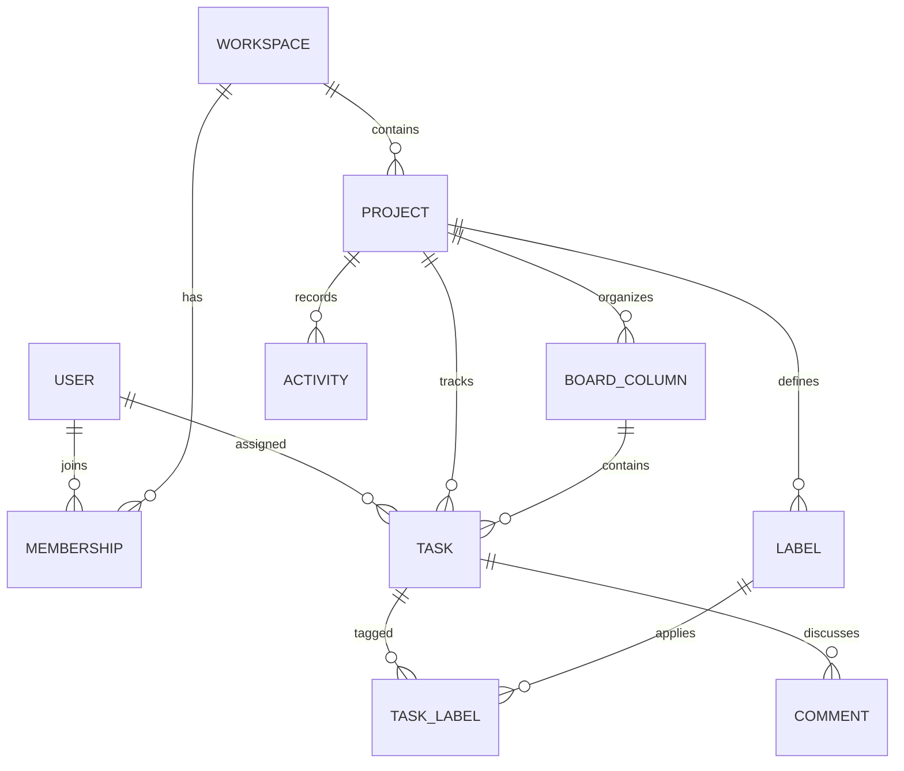

# Focusboard

Focusboard is a full-stack project management application built with Next.js,
TypeScript, Prisma, and SQLite. It gives teams a focused workspace for planning
projects, assigning work, tracking deadlines, and moving tasks through a Kanban
workflow.

## Highlights

- Secure registration and login with BCrypt password hashing
- Signed HTTP-only cookie sessions
- Multi-project workspaces and project switching
- Drag-and-drop Kanban board with persisted ordering
- Task creation, editing, deletion, priorities, labels, and deadlines
- Workspace member assignment
- Task comments and project activity history
- Search and filters for priority and assignee
- Project completion, task, and overdue metrics
- Responsive desktop and mobile experience
- Seeded demo workspace for immediate exploration
- Prisma migrations, validation tests, linting, and production build checks

## Tech Stack

| Layer | Technology |
| --- | --- |
| Framework | Next.js 16 App Router |
| Language | TypeScript |
| UI | React 19, Tailwind CSS 4, custom CSS |
| Database | SQLite |
| ORM | Prisma ORM 7 |
| Authentication | BCrypt, JOSE/JWT, HTTP-only cookies |
| Drag and drop | dnd-kit |
| Validation | Zod Mini |
| Testing | Vitest |
| Icons | Lucide React |

## Demo Account

```text
Email: demo@focusboard.dev
Password: Demo1234!
```

The seed also creates a workspace with three members, four board columns, labels,
sample tasks, deadlines, and activity.

## Getting Started

Requirements:

- Node.js 20.19+, 22.12+, or 24+
- npm

Install dependencies:

```bash
npm install
```

Create local environment values:

```bash
cp .env.example .env
```

On PowerShell:

```powershell
Copy-Item .env.example .env
```

For production, replace `SESSION_SECRET` with at least 32 random characters and
set `SESSION_SECURE_COOKIE="true"` when the app is served over HTTPS.

Create and seed the database:

```bash
npm run db:generate
npm run db:migrate -- --name init
npm run db:seed
```

Start development:

```bash
npm run dev
```

Open http://localhost:3000.

## Available Commands

| Command | Purpose |
| --- | --- |
| `npm run dev` | Start the development server |
| `npm run build` | Create a production build |
| `npm start` | Run the production build |
| `npm run lint` | Run ESLint |
| `npm test` | Run Vitest |
| `npm run db:generate` | Generate Prisma Client |
| `npm run db:migrate` | Create/apply a development migration |
| `npm run db:seed` | Load the demo workspace |
| `npm run db:studio` | Open Prisma Studio |

## Database Model



## API Routes

| Method | Route | Purpose |
| --- | --- | --- |
| `POST` | `/api/auth/register` | Create an account and workspace |
| `POST` | `/api/auth/login` | Start an authenticated session |
| `POST` | `/api/auth/logout` | End the session |
| `POST` | `/api/projects` | Create a project |
| `POST` | `/api/tasks` | Create a task |
| `PATCH` | `/api/tasks/{taskId}` | Update a task |
| `DELETE` | `/api/tasks/{taskId}` | Delete a task |
| `POST` | `/api/tasks/reorder` | Persist board ordering |
| `GET` | `/api/tasks/{taskId}/comments` | Load comments |
| `POST` | `/api/tasks/{taskId}/comments` | Add a comment |

Every project and task mutation verifies that the authenticated user belongs to
the owning workspace. Task relations are also checked so columns, assignees, and
labels cannot be linked across unrelated projects.

## Project Structure

```text
prisma/
|-- migrations/             Database migration history
|-- schema.prisma           Relational data model
`-- seed.ts                 Demo workspace

src/
|-- app/
|   |-- api/                Secured route handlers
|   |-- dashboard/          Server-rendered dashboard
|   |-- login/              Login page
|   `-- register/           Registration page
|-- components/
|   |-- auth/               Authentication forms
|   `-- dashboard/          Kanban interface and modals
|-- lib/                    Auth, database, authorization, and validation
`-- types/                  Client-safe board contracts
```

## Future Improvements

- Team invitations and role management
- File attachments and object storage
- Real-time updates with WebSockets
- Calendar and timeline views
- Email notifications
- PostgreSQL production profile
- Audit log export
- Playwright browser tests

## Author

Shahid Ali
